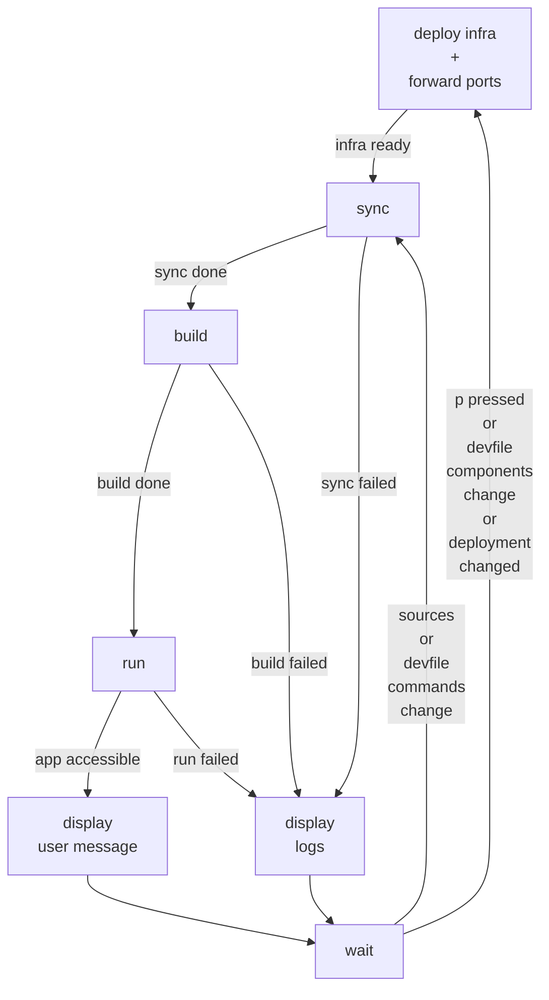

## current (odo v3.9.0)

Steps:

- Pre-deployment (build/push of images, apply of K8s resources)
- Creation of Deployment, waiting for pod up and running
- inner loop

TODO
- Remove first Push from dev.Start?

  For versions < 3.10, Push is called before to run the Watch process, then is called after different events

  For versions >= 3.10, the first call to Push is done as part of the Watch process

- Port forward part of infra or inner loop?

  On Podman, port forwarding is done as part of the creation of the pod (using hostPort).

  On Cluster, the port forwarding is started every time the Run command is started, and stopped every time the Run commend is stopped.

  It could be simplier to have to port forwarding done as part of the pod creation on cluster too. In this we will need to manage the state of the port forwarding in the background (for example, port forwarding fails when a request is done when the Run command is rnot running, we need to restart it correctly, on the same port - even when random port is used)

## Watches

### Infra

Images, k8s resources, Deployment, port forward depends on:
- devfile and dependencies (components)
- cluster (deployment, pod)
- keys (p)
  => restart at pre-deployment

### Inner loop

Inner loop depends on:
- devfile and dependencies (commands, events)
- sources
- keys (p)
  => restart inner loop only

## Inner loop

