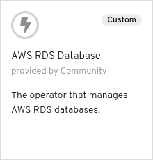

# Binding an Imported app to an Off-cluster Operator Managed AWS RDS Database

## Introduction

This scenario illustrates binding an imported application to an off-cluster operated managed AWS RDS Database. The scenario also shows how to bind the backing service to two different independent applications and a use of the `envVarPrefix` feature of the Service Binding Operator to specify a prefix for the names of the injected environment variables.

## Actions to Perform by Users in 2 Roles

In this example there are 2 roles:

* Cluster Admin - Installs the operators to the cluster
* Application Developer - Imports Shell and Node.js applications, creates a DB instance, creates requests to bind (connect) the applications and the DB.

### Cluster Admin

First, let's be the cluster admin. We need to install 2 operators into the cluster:

* Service Binding Operator
* Backing Service Operator

The Backing Service Operator represents a database required by the
applications. We'll use [aws-rds-operator](https://github.com/operator-backing-service-samples/aws-rds) to
manage off-cluster RDS database instances on AWS.

#### Install the Service Binding Operator

Navigate to the `Operators`->`OperatorHub` in the OpenShift console and in the `Developer Tools` category select the `Service Binding Operator` operator


and install the `alpha` version.

Alternatively, you can perform the same task manually using the following command:

``` shell
make install-service-binding-operator-community
```

This makes the `ServiceBindingRequest` custom resource available, that the application developer will use later.

##### :bulb: Latest `master` version of the operator

It is also possible to install the latest `master` version of the operator instead of the one from `community-operators`. To enable that an `OperatorSource` has to be installed with the latest `master` version:

``` shell
cat <<EOS | kubectl apply -f -
---
apiVersion: operators.coreos.com/v1
kind: OperatorSource
metadata:
  name: redhat-developer-operators
  namespace: openshift-marketplace
spec:
  type: appregistry
  endpoint: https://quay.io/cnr
  registryNamespace: redhat-developer
EOS
```

Alternatively, you can perform the same task manually using the following command before going to the Operator Hub:

``` shell
make install-service-binding-operator-source-master
```

or running the following command to install the operator completely:

``` shell
make install-service-binding-operator-master
```

#### Install the DB operator using an `OperatorSource`

##### Setup AWS Credentials

The AWS RDS operator requires AWS credentials to be able to work with AWS. Follow the [instructions](https://github.com/operator-backing-service-samples/aws-rds#set-up-and-config) to install the proper secret.

``` shell
 make install-aws-rds-operator-secrets
```

##### Install the operator source

Apply the [AWS RDS Operator Source](./operator-source.aws-rds-operator.yaml):

``` shell
make install-aws-rds-operator-source
```

Then navigate to the `Operators`->`OperatorHub` in the OpenShift console under the `openshift-marketplace` project and in the `Database` category select the `AWS RDS Database` operator



and install it.

This makes the `RDSDatabase` custom resource available, that we as the application developer will [use later](#create-a-db-instance-for-the-application).

### Application Developer

Now, let's play the role of an application developer. In the following sections we will:

* [Create new project (namespace)](#create-a-project-namespace-called-service-binding-demo)
* Deploy 2 applications:
  * [A simple shell application](#deploy-shell-application)
  * [CRUD Node.js application](#import-nodejs-application)
* [Create DB instance](#create-a-db-instance-for-the-application)
* Bind the Shell app to the DB
* Bind the Node.js app to the DB

#### Create a project (namespace) called `service-binding-demo`

The application and the DB needs a namespace to live in so let's create one for them:

``` shell
oc new-project service-binding-demo
```

Alternatively, you can perform the same task with this make command:

``` shell
make create-project
```

#### Deploy Shell application

To illustrate and verify that the binding works we will use a simple shell application that lists all environment variables that start with the `MYDB_` prefix and then goes to sleep for an hour.

To deploy the application use the `deploy-shell-app` make target:

```shell
make deploy-shell-app
```

This ultimately creates a pod where the shell application lives:

```shell
$ oc get pods -n service-binding-demo -o custom-columns=NAME:.metadata.name,STATUS:.status.phase
NAME                 STATUS
shell-app-1-build    Succeeded
shell-app-1-cszbz    Running
shell-app-1-deploy   Succeeded

$ oc logs shell-app-1-cszbz
Container started
Listing all MYDB_* env variables:
╭─[ MYDB_* ]
╰─]
Taking a nap for 1 hour...
```

#### Import NodeJS application

In this example we will import an arbitrary [Node.js application](https://github.com/pmacik/nodejs-rest-http-crud).

In the OpenShift Console switch to the Developer perspective. (Make sure you have selected the `service-binding-demo` project). Navigate to the `+ADD` page from the menu and then click on the `[Import from Git]` button. Fill in the form with the following:

* `Git Repo URL` = `https://github.com/pmacik/nodejs-rest-http-crud`
* `Show Advanced Git Options`->`Git Reference` = `awsrds-and-envprefix`
* `Project` = `service-binding-demo`
* `Application`->`Create New Application` = `nodejs-app`
* `Name` = `nodejs-app`
* `Builder Image` = `Node.js`
* `Create a route to the application` = checked

and click on the `[Create]` button.

Notice, that during the import no DB config was mentioned or requested.

When the application is running navigate to its route to verify that it is up. Notice that in the header it says `(DB: N/A)`. That means that the application is not connected to a DB and so it should not work properly. Try the application's UI to add a fruit - it causes an error proving that the DB is not connected.

#### Create a DB instance for the application

Now we utilize the DB operator that the cluster admin has installed. To create a DB instance just create a [`RDSDatabase` custom resource](./rds.mydb.yaml) in the `service-binding-demo` namespace called `mydb` along with [a secret](./secret.mydb.yaml) with credentials for the DB by running the `deploy-mydb` make target:

``` shell
make deploy-mydb
```

It takes usually around 5 minutes to spin-up a new instance of the RDS database in AWS.

To check the status of that we can take a look at the `RDSDatabase` custom resource in the meantime:

```shell
oc get rdsdb mydb -n service-binding-demo -o yaml
```

```yaml
apiVersion: aws.pmacik.dev/v1alpha1
kind: RDSDatabase
metadata:
  ...
spec:
  ...
status:
  dbConnectionConfig: ""
  dbCredentials: ""
  message: Attempting to Create a DB
  state: DBCreating
```

When the DB is successfully created, the status changes to :

```yaml
status:
  dbConnectionConfig: mydb
  dbCredentials: mydb
  message: ConfigMap Created
  state: Completed
```

#### Bind the DB to the Shell application

Now, when the DB is up and running, we need to tell the Shell application where to find it and how to connect to it. We let the Service Binding Operator to 'do the magic' for us.

As mentioned above the Shell application lists all environment variables that start with the `MYDB_` prefix. So we need to make sure that the variables injected by the binding have this prefix. Conveniently, the Service Binding Operator can help us there, too.

All we need to do is to create the following [`ServiceBindingRequest`](./service-binding-request.shell-app.yaml):

```yaml
---
apiVersion: apps.openshift.io/v1alpha1
kind: ServiceBindingRequest
metadata:
  name: mydb.to.shell-app
  namespace: service-binding-demo
spec:
  envVarPrefix: "MYDB"
  backingServiceSelector:
    group: aws.pmacik.dev
    version: v1alpha1
    kind: RDSDatabase
    resourceRef: mydb
  applicationSelector:
    resourceRef: shell-app
    group: apps.openshift.io
    version: v1
    resource: deploymentconfigs
```

There are 3 interesting parts in the request:

* `envVarPrefix` - specifies the prefix for all the environment variables injected to the bound application
* `backingServiceSelector` - used to find the backing service - our operator-backed DB instance called `mydb`
* `applicationSelector` - used to search for the application based on the resourceRef and the `resourceKind` of the application to be a `DeploymentConfig`

We can use `create-service-binding-request-shell-app` make target to create the binding request for us:

```shell
make create-service-binding-request-shell-app
```

That causes the Shell application to be re-deployed.

Once the new version is up, we can check the logs to verify that the binding worked:

```shell
$ oc logs shell-app-2-49pzw -n service-binding-demo
Container started
Listing all MYDB_* env variables:
╭─[ MYDB_* ]
MYDB_RDSDATABASE_CONFIGMAP_DB_HOST=mydb-service-binding-demo.*********.us-east-2.rds.amazonaws.com
MYDB_RDSDATABASE_SECRET_DB_USERNAME=postgres
MYDB_RDSDATABASE_CONFIGMAP_DB_PORT=9432
MYDB_RDSDATABASE_USERNAME=postgres
MYDB_RDSDATABASE_DBNAME=mydb
MYDB_RDSDATABASE_SECRET_DB_PASSWORD=passwordorsomething
╰─]
Taking a nap for 1 hour...
```

We can see that the binding indeed worked and the Service Binding Operator sucessfully injected all the environment variables that the AWS RDS exposes all starting with our prefix `MYDB_` that we specified above in the `ServiceBindingRequest`.

That's enough for the Shell application. Let's see if the connection to the DB really works. We do that in the next section with the Node.js application.

#### Bind the DB to the Node.js application

The Node.js application should be already up and running after we [imported it before](#import-nodejs-application). We  can

Let's check by navigating to the application's route to verify that it is up. Notice that in the header it says `(DB: N/A)`. That means that the application is not connected to DB and so it should not work properly. Try the application's UI to add a fruit - it causes an error proving that the DB is not connected.

Now we ask the Service Binding Operator to bind the DB to the Node.js application in the following step:

* [Create `ServiceBindingRequest`](#create-servicebindingrequest-for-the-nodejs-application)

#### Create `ServiceBindingRequest` for the Node.js application

Now the only thing that remains is to connect the DB and the application. We let the Service Binding Operator to do the connection for us.

Create the following [`ServiceBindingRequest`](./service-binding-request.nodejs-app.yaml):

```yaml
---
apiVersion: apps.openshift.io/v1alpha1
kind: ServiceBindingRequest
metadata:
  name: mydb.to.nodejs-app
  namespace: service-binding-demo
spec:
  envVarPrefix: "MYDB"
  backingServiceSelector:
    group: aws.pmacik.dev
    version: v1alpha1
    kind: RDSDatabase
    resourceRef: mydb
  applicationSelector:
    resourceRef: nodejs-app
    group: apps
    version: v1
    resource: deployments
```

The request is basically the same as the one we used for the Shell application. The only difference is the application name used in resourceRef used in the `applicationSelector`.

We can use the `create-service-binding-request-nodejs-app` make target to create the request for us:

```shell
make create-service-binding-request-nodejs-app
```

That causes the Node.js application to be re-deployed.

Once the new version is up, go the application's route to check the UI. In the header you can see `(DB: mydb)` which indicates that the application is connected to a DB and its name is `mydb`. Now you can try the UI again but now it works!

That's it, folks!
