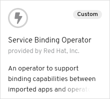
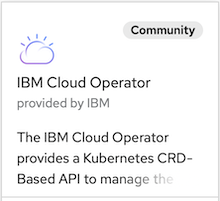

# Binding an Imported app to an Off-cluster Operator Managed IBM Cloud Service

## Introduction

This scenario illustrates binding an imported application to an off-cluster operator-managed IBM Cloud Service. The scenario also shows the use of the `customEnvVar` feature of the Service Binding Operator to specify a mapping for the injected environment variables.

## Actions to Perform by Users in 2 Roles

In this example there are 2 roles:

* Cluster Admin - Installs the operators into the cluster
* Application Developer - Imports Node.js applications, creates an IBM Language Translator instance and creates requests to bind (connect) the applications with the Translator Service.

### Cluster Admin

First, let's be the cluster admin. We need to install 2 operators into the cluster:

* Service Binding Operator
* Backing Service Operator

The Backing Service Operator represents an IBM Cloud service required by the
application. For this particular example, we will provision an IBM Language Translator service,
but we can use the same operator to create any other service on the IBM Cloud.  We'll use the [IBM Cloud Operator](https://operatorhub.io/operator/ibmcloud-operator) to
manage off-cluster service instances on IBM Cloud.

#### Install the Service Binding Operator

Navigate to the `Operators`->`OperatorHub` in the OpenShift console and in the `Developer Tools` category select the `Service Binding Operator` operator



and install the `alpha` version.

Alternatively, you can perform the same task manually using the following command:

``` shell
make install-service-binding-operator-community
```

This makes the `ServiceBindingRequest` custom resource available, that the application developer will use later.

##### :bulb: Latest `master` version of the operator

It is also possible to install the latest `master` version of the operator instead of the one from `community-operators`. To enable that an `OperatorSource` has to be installed with the latest `master` version:

``` shell
cat <<EOS | kubectl apply -f -
---
apiVersion: operators.coreos.com/v1
kind: OperatorSource
metadata:
  name: redhat-developer-operators
  namespace: openshift-marketplace
spec:
  type: appregistry
  endpoint: https://quay.io/cnr
  registryNamespace: redhat-developer
EOS
```

Alternatively, you can perform the same task manually using the following command before going to the Operator Hub:

``` shell
make install-service-binding-operator-source-master
```

or running the following command to install the operator completely:

``` shell
make install-service-binding-operator-master
```

#### Install the IBM Cloud operator

Navigate to `Operators`->`OperatorHub` in the OpenShift console; under the `Cloud Provider` category select the `IBM Cloud Operator`



and install an `alpha` version.

This makes the `Service` and `Binding` with API version `ibmcloud.ibm.com/v1alpha1` custom resources available for the application developer.

##### Setup IBM Cloud Credentials

The IBM Cloud operator requires IBM Cloud credentials to operate. Follow the [instructions](https://operatorhub.io/operator/ibmcloud-operator) in the `Requirements` section to create the required secret and config map defaults.

### Application Developer

Now, let's play the role of an application developer. In the following sections we will:

* [Create a new project (namespace)](#create-a-project-namespace-called-service-binding-demo)
* [Import the Node.js application](#import-nodejs-application)
* [Create an IBM Language Translator service instance](#create-an-ibm-language-translator-service-instance)
* [Bind the Language Translator Service to the Node.js application](#bind-the-language-translator-service-to-the-node.js-application)


#### Create a project (namespace) called `service-binding-demo`

The application and the service instance needs a namespace to live in so let's create one for them:

``` shell
oc new-project service-binding-demo
```

#### Import NodeJS application

In this example we will import an existing [Node.js sample application for the IBM Language Translator Service](https://github.com/watson-developer-cloud/language-translator-nodejs).

```shell
oc new-app https://github.com/watson-developer-cloud/language-translator-nodejs.git
```

When the image build is complete, the application will attempt to start but it will crash because
there the required backed service is not configured.

#### Create an IBM Language Translator service instance

Now we use the IBM Cloud Operator that the cluster admin has installed. To create a language translator instance just create a [`Service` custom resource for languagee translator](./language-translator.yaml) in the `service-binding-demo` namespace called `mytranslator` along with [a `Binding` custom resource](./language-translator-binding.yaml) by running:

``` shell
oc apply -f language-translator.yaml
oc apply -f language-translator-binding.yaml
```

In alternative, you may also create the service from the OpenShift Web Console in the Developer perspective,
navigating to `Add`->`From Catalog`, selecting `Service`, clicking `Create` and using the default sample
template which provision the Language Translator Service (this might change in the future, so it is reccommended to check against the sample template provided [here](./language-translator.yaml)). 
Repeat the same process for adding a binding by navigating to `Add`->`From Catalog`, selecting `Binding`, clicking `Create` and using the default sample template which creates a binding the Language Translator Service. 

Note that a binding needs to be created, as service instances and service credentials have different
lifecycles for IBM Cloud services. The Service Binding Operator does not create credentials for 
a service but it rather gathers, organizes and inject credentials into apps.

It takes usually few seconds to spin-up a new instance of the language translator service in IBM Cloud.

To check the status of the service we can take a look at the `Service` custom resource. After provisioning
it will look something like the following:

```shell
oc get service.ibmcloud mytranslator -n service-binding-demo -o yaml
```

```yaml
apiVersion: ibmcloud.ibm.com/v1alpha1
kind: Service
metadata:
  ...
spec:
  ...
status:
  context:
    org: dettori@us.ibm.com
    region: us-south
    resourcegroup: default
    resourcelocation: us-south
    space: dev
  instanceId: 'crn:v1:bluemix:public:language-translator:us-south:a/0b5a00334eaf9eb9339d2ab48f20d7f5:a3bafbe6-f873-419d-9b08-570bb35aca7e::'
  message: Online
  plan: lite
  serviceClass: language-translator
  serviceClassType: ""
  state: Online
```

Similarly, you the status of the binding can be checked with:

```shell
oc get binding.ibmcloud mytranslator-binding -n service-binding-demo -o yaml
```

```yaml
apiVersion: ibmcloud.ibm.com/v1alpha1
kind: Binding
metadata:
  ...
spec:
  ...
status:
  instanceId: 'crn:v1:bluemix:public:language-translator:us-south:a/0b5a00334eaf9eb9339d2ab48f20d7f5:a3bafbe6-f873-419d-9b08-570bb35aca7e::'
  keyInstanceId: crn:v1:bluemix:public:language-translator:us-south:a/0b5a00334eaf9eb9339d2ab48f20d7f5:a3bafbe6-f873-419d-9b08-570bb35aca7e:resource-key:2e6dedf1-34a3-403b-ad06-d8dafcc90247
  message: Online
  secretName: mytranslator-binding
  state: Online
```

You may also verify that a secret with the Language Translator credentials gets created in the
`service-binding-demo` namespace:

```shell
oc get secret mytranslator-binding -n service-binding-demo
```

```shell
NAME                   TYPE     DATA   AGE
mytranslator-binding   Opaque   6      5m36s
```

#### Bind the Language Translator Service to the Node.js application

Once the backing service is up and running, we need to tell the Node.js application where to find it and how to connect to it. We let the Service Binding Operator to 'do the magic' for us.

We did not modify the Language Translator sample application, we are using it 'as is', and therefore
we need to do some mapping of the credential keys provided by the backing service with the 
environment variables required by the sample node.js app.

More specifically, the node.js app requires two environment variables: `LANGUAGE_TRANSLATOR_URL` 
and `LANGUAGE_TRANSLATOR_IAM_APIKEY`. These keys are available in the backing service secret as
`url` and `apikey` respectively, and they can be mapped to the variables required by the app using
the `customEnvVar` feature of the service binding operator.

All we need to do is to create the following [`ServiceBindingRequest`](./service-binding-request.nodejs-app.yaml):

```yaml
apiVersion: apps.openshift.io/v1alpha1
kind: ServiceBindingRequest
metadata:
  name: mytranslator.to.nodejs-app
  namespace: service-binding-demo
spec:
  backingServiceSelector:
    group: ibmcloud.ibm.com
    version: v1alpha1
    kind: Binding
    resourceRef: mytranslator-binding
  applicationSelector:
    resourceRef: language-translator-nodejs
    group: apps.openshift.io
    version: v1
    resource: deploymentconfigs
  customEnvVar:
     - name: LANGUAGE_TRANSLATOR_URL
       value: '{{ index .status.secretName "url" }}'
     - name: LANGUAGE_TRANSLATOR_IAM_APIKEY
       value: '{{ index .status.secretName "apikey" }}'     
```

There are 3 interesting parts in the request:

* `backingServiceSelector` - used to find the backing service - the operator-backed language translator instance with name `mytranslator-binding`.
* `applicationSelector` - used to search for the application based on the resourceRef and the `resourceKind` of the application to be a `DeploymentConfig`, matched by the label `app=language-translator-nodejs`.
* `customEnvVar` - specifies the mapping for the environment variables injected into the bound application.

We can use run the following command to create the binding request:

```shell
oc apply -f service-binding-request.nodejs-app.yaml
```

That causes the node.js deployment to restart the pod with the new mapping.

Once the new version is up, we can check the logs to verify that the binding worked:

```shell
$ kubectl logs -l app=language-translator-nodejs -n service-binding-demo
npm info lifecycle language-translator-demo@0.3.10~start: language-translator-demo@0.3.10

> language-translator-demo@0.3.10 start /opt/app-root/src
> node server.js

Server running on port: 8080
```

We can see that the binding indeed worked and the Service Binding Operator sucessfully injected all the custom environment variables that  that we specified above in the `ServiceBindingRequest`.

To create a route for the application, run the following command:

```shell
oc expose svc/language-translator-nodejs
```

Run the following command to access the route URL:

```shell
oc get route language-translator-nodejs
```

Open a browser and go to the URL found under `HOST/PORT`. Verify that the application web page displays and then test it
by going to the `Input` section under `Translate Text`, entering some text in one of the available languages
in the pull down and verifying that language is correctly detected and translated.