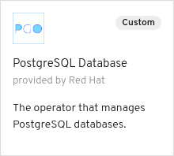

# Binding an Imported app to an In-cluster Operator Managed PostgreSQL Database

## Introduction

This scenario illustrates binding an imported application to an in-cluster operated managed PostgreSQL Database.

Note that this example app is configured to operate with OpenShift 4.3 or newer. To use this example
app with OpenShift 4.2, replace references to resource:`Deployment`s with `DeploymentConfig`s and group:`apps` with `apps.openshift.io`.

## Actions to Perform by Users in 2 Roles

In this example there are 2 roles:

* Cluster Admin - Installs the operators to the cluster
* Application Developer - Imports a Node.js application, creates a DB instance, creates a request to bind the application and DB (to connect the DB and the application).

### Cluster Admin

The cluster admin needs to install 2 operators into the cluster:

* Service Binding Operator
* Backing Service Operator

A Backing Service Operator that is "bind-able," in other
words a Backing Service Operator that exposes binding information in secrets, config maps, status, and/or spec
attributes. The Backing Service Operator may represent a database or other services required by
applications. We'll use [postgresql-operator](https://github.com/operator-backing-service-samples/postgresql-operator) to
demonstrate a sample use case.

#### Install the Service Binding Operator

Navigate to the `Operators`->`OperatorHub` in the OpenShift console and in the `Developer Tools` category select the `Service Binding Operator` operator


and install the `alpha` version.

Alternatively, you can perform the same task manually using the following command:

``` shell
make install-service-binding-operator-community
```

This makes the `ServiceBindingRequest` custom resource available, that the application developer will use later.

##### :bulb: Latest `master` version of the operator

It is also possible to install the latest `master` version of the operator instead of the one from `community-operators`. To enable that an `OperatorSource` has to be installed with the latest `master` version:

``` shell
cat <<EOS | kubectl apply -f -
---
apiVersion: operators.coreos.com/v1
kind: OperatorSource
metadata:
  name: redhat-developer-operators
  namespace: openshift-marketplace
spec:
  type: appregistry
  endpoint: https://quay.io/cnr
  registryNamespace: redhat-developer
EOS
```

Alternatively, you can perform the same task manually using the following command before going to the Operator Hub:

``` shell
make install-service-binding-operator-source-master
```

or running the following command to install the operator completely:

``` shell
make install-service-binding-operator-master
```

#### Install the DB operator using an `OperatorSource`

Apply the following `OperatorSource`:

``` shell
cat <<EOS |kubectl apply -f -
---
apiVersion: operators.coreos.com/v1
kind: OperatorSource
metadata:
  name: db-operators
  namespace: openshift-marketplace
spec:
  type: appregistry
  endpoint: https://quay.io/cnr
  registryNamespace: pmacik
EOS
```

Alternatively, you can perform the same task with this make command:

``` shell
make install-backing-db-operator-source
```

Then navigate to the `Operators`->`OperatorHub` in the OpenShift console and in the `Database` category select the `PostgreSQL Database` operator



and install a `stable` version.

This makes the `Database` custom resource available, that the application developer will use later.

### Application Developer

#### Create a namespace called `service-binding-demo`

The application and the DB needs a namespace to live in so let's create one for them:

``` shell
cat <<EOS |kubectl apply -f -
---
kind: Namespace
apiVersion: v1
metadata:
  name: service-binding-demo
EOS
```

Alternatively, you can perform the same task with this make command:

``` shell
make create-project
```

#### Import an application

In this example we will import an arbitrary [Node.js application](https://github.com/pmacik/nodejs-rest-http-crud).

In the OpenShift Console switch to the Developer perspective. (Make sure you have selected the `service-binding-demo` project). Navigate to the `+ADD` page from the menu and then click on the `[Import from Git]` button. Fill in the form with the following:

* `Git Repo URL` = `https://github.com/pmacik/nodejs-rest-http-crud`
* `Project` = `service-binding-demo`
* `Application`->`Create New Application` = `NodeJSApp`
* `Name` = `nodejs-rest-http-crud`
* `Builder Image` = `Node.js`
* `Create a route to the application` = checked

and click on the `[Create]` button.

Notice, that during the import no DB config was mentioned or requestd.

When the application is running navigate to its route to verify that it is up. Notice that in the header it says `(DB: N/A)`. That means that the application is not connected to a DB and so it should not work properly. Try the application's UI to add a fruit - it causes an error proving that the DB is not connected.

#### Create a DB instance for the application

Now we utilize the DB operator that the cluster admin has installed. To create a DB instance just create a `Database` custom resource in the `service-binding-demo` namespace called `db-demo`:

``` shell
cat <<EOS |kubectl apply -f -
---
apiVersion: postgresql.baiju.dev/v1alpha1
kind: Database
metadata:
  name: db-demo
  namespace: service-binding-demo
spec:
  image: docker.io/postgres
  imageName: postgres
  dbName: db-demo
EOS
```

Alternatively, you can perform the same task with this make command:

``` shell
make create-backing-db-instance
```

#### Express an intent to bind the DB and the application

Now, the only thing that remains is to connect the DB and the application. We let the Service Binding Operator to 'magically' do the connection for us.

Create the following `ServiceBindingRequest`:

``` shell
cat <<EOS |kubectl apply -f -
---
apiVersion: apps.openshift.io/v1alpha1
kind: ServiceBindingRequest
metadata:
  name: binding-request
  namespace: service-binding-demo
spec:
  applicationSelector:
    resourceRef: nodejs-rest-http-crud
    group: apps
    version: v1
    resource: deployments
  backingServiceSelector:
    group: postgresql.baiju.dev
    version: v1alpha1
    kind: Database
    resourceRef: db-demo
EOS
```

Alternatively, you can perform the same task with this make command:

``` shell
make create-service-binding-request
```

There are 2 parts in the request:

* `applicationSelector` - used to search for the application based on the resourceRef that we set earlier and the `group`, `version` and `resource` of the application to be a `Deployment`.
* `backingServiceSelector` - used to find the backing service - our operator-backed DB instance called `db-demo`.

That causes the application to be re-deployed.

Once the new version is up, go to the application's route to check the UI. In the header you can see `(DB: db-demo)` which indicates that the application is connected to a DB and its name is `db-demo`. Now you can try the UI again but now it works!

When the `ServiceBindingRequest` was created the Service Binding Operator's controller injected the DB connection information into the application's `Deployment` as environment variables via an intermediate `Secret` called `binding-request`:

``` yaml
spec:
  template:
    spec:
      containers:
        - envFrom:
          - secretRef:
              name: binding-request
```

#### ServiceBindingRequestStatus

`ServiceBindingRequestStatus` depicts the status of the Service Binding operator. More info [here](https://github.com/kubernetes/community/blob/master/contributors/devel/sig-architecture/api-conventions.md#spec-and-status).

| Field | Description |
|-------|-------------|
| Secret | The name of the intermediate secret |

That's it, folks!
